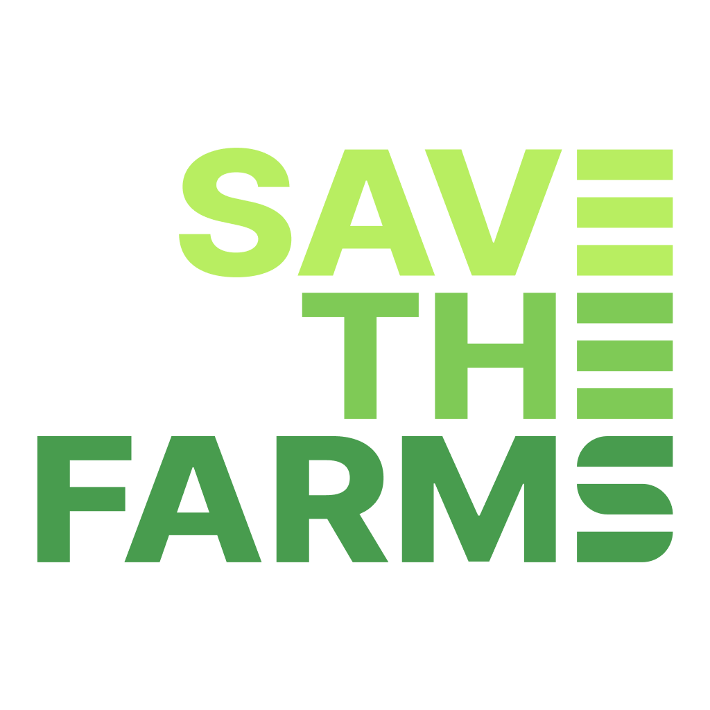

<p align="center">
  
</p>

<h1 align="center">SAVE THE FARMS</h1>

<p align="center">
  <strong>Organic Waste to Green Energy</strong>
</p>

<p align="center">
  Powering a Sustainable Future
</p>

<p align="center">
  Transforming Organic Waste into Valuable Resources
</p>

<p align="center">
  
  
  
  
  
</p>

---

## 🌎 About Save The Farms

Save The Farms is a climate technology company developing circular resource recovery systems that transform organic waste into biochar, renewable energy, and carbon reduction solutions.

Our mission is to create sustainable agricultural ecosystems by integrating waste treatment, energy recovery, carbon management, and smart agriculture technologies.

---

## ♻️ What We Do

We convert organic waste streams into valuable environmental and agricultural resources.

### Waste Sources

* Food Waste
* Livestock Manure
* Agricultural Residues
* Sewage Sludge
* Organic By-products

### Outputs

* Biochar
* Renewable Energy
* Carbon Credits
* Soil Conditioners
* Smart Farm Resources

---

## 🔬 Core Technologies

### Biochar Production

Advanced pyrolysis systems that convert organic waste into high-performance biochar for agriculture and environmental applications.

### Waste Heat Recovery

Recovering thermal energy generated during processing and reusing it within agricultural and industrial systems.

### Carbon Reduction & MRV

Measurement, Reporting and Verification systems for carbon reduction tracking and carbon credit generation.

### Modular Resource Recovery Plants

Scalable waste-to-value infrastructure designed for municipalities, agricultural facilities, and industrial applications.

### Smart Agriculture Integration

Connecting biochar, recovered energy, and environmental data with next-generation smart farming systems.

---

## ⚙️ Circular Resource System

```text
Organic Waste
      ↓
Collection & Sorting
      ↓
Pretreatment
      ↓
Pyrolysis
      ↓
Biochar Production
      ↓
Energy Recovery
      ↓
Carbon Measurement
      ↓
Agriculture & Environmental Applications
```

---

## 🌱 Environmental Impact

### Carbon Reduction

* Long-term carbon sequestration
* Reduced greenhouse gas emissions
* Carbon credit generation

### Sustainable Agriculture

* Improved soil fertility
* Enhanced water retention
* Better nutrient efficiency
* Increased crop productivity

### Circular Economy

* Waste-to-resource conversion
* Renewable energy generation
* Resource recovery and reuse

---

## 🌍 Global Presence

Save The Farms is actively expanding through research collaborations, pilot projects, and commercialization initiatives across:

* Republic of Korea
* Mongolia
* Germany
* Canada
* United States
* Malaysia
* Vietnam
* India

---

## 🏆 Achievements

* Multiple patents in biochar, carbon capture, and resource recovery technologies
* Government-funded climate technology programs
* ESG and green innovation certifications
* International partnerships and pilot projects
* Carbon reduction and circular economy initiatives

---

## 🚀 Vision

We envision a future where organic waste is no longer treated as a disposal problem.

Instead, it becomes a renewable resource that generates:

* Clean Energy
* Carbon Reduction
* Sustainable Agriculture
* Circular Economic Growth

Our goal is to lead the global transition toward carbon-negative resource recovery systems.

---

## 🤝 Collaboration

We welcome collaboration opportunities with:

* Governments
* Municipalities
* Research Institutes
* Universities
* Agricultural Organizations
* Environmental Agencies
* Industrial Partners
* Climate-Tech Investors

---

## 📫 Contact

SAVE THE FARMS

Climate Technology • Biochar • Carbon Reduction • Circular Agriculture

Building a Sustainable Global Ecosystem Through Organic Waste Innovation.
